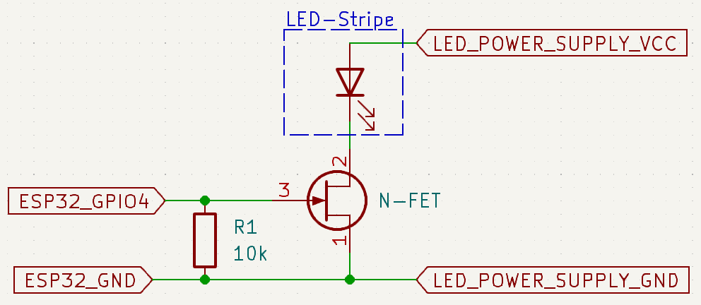

# LightAlarmClock

Really minimalistic light alarm clock.

It just dimms up a LED-Stripe at a certain time.

The start time can be set in the code. Also the day of the week can be set. So it can be configured to just run from Monday to Friday.
The brightness will ramp up from zero to max brightness in a configurable time. Afterwards the light will stay on for a configurable amount of time before switchin off.

The current time will be received via NTP.

If the WiFi is not connected, the ESP32 will set up an configuration access point (192.168.4.1), where the WiFi credentials can be set.

## Schematic

